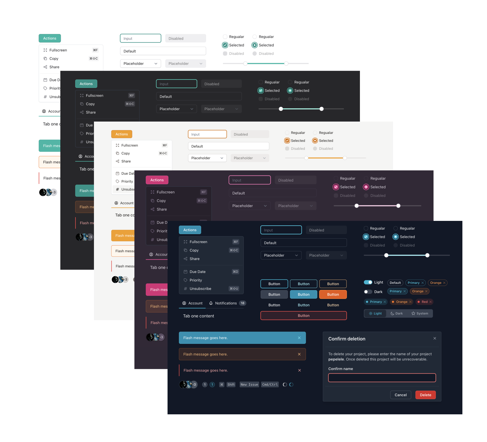

# Vechai UI

Collection of Accessible React UI Components using TailwindCSS.

-   Documentation: [docs.vechai.dev](https://docs.vechai.dev)
-   NPM: [@vechaiui/react](https://www.npmjs.com/package/@vechaiui/react)
-   License: [MIT](./LICENSE)
